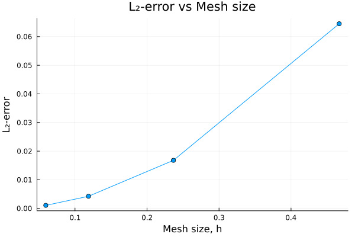
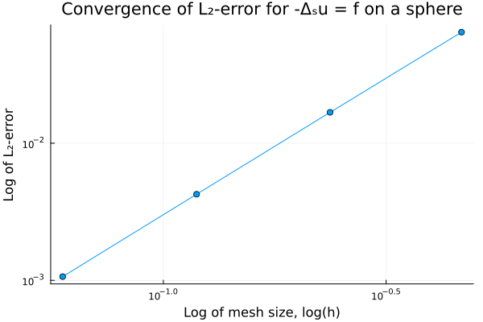

# Solving the Laplace-Beltrami problem on a sphere
This folder aims to solve the stationary problem
```math
-\Delta_{S}u = f \quad \mathrm{on} \quad \Omega_{h}
```
where $\Omega_{h}$ is a mesh of a unit sphere with great edge length, $h$. 

A manufactured solution,
```math
u_{exact}(x,y,z) = z
```
and its corresponding RHS function,
```math
f_{rhs}(x,y,z) = 2z
```
## Results
| **Refinement** | **Mesh size** | **$L_2$ error** | **EOC** |
|---------------:|--------------:|-------------:|--------:|
|            0  |      0.466891 |    0.0645058 |     NaN |
|            1  |      0.236663 |    0.0167925 | 1.98074 |
|            2 |      0.118748 |   0.00424571 | 1.99383 |
|            3  |     0.0594263 |   0.00106472 | 1.99807 |

  

## Implementation

### Mesh generation
The spherical meshes were created using Gmsh (See [include/gen_sphere.jl](../../include/gen_sphere.jl))

### Error calculation
See [documentation](../../include/README.md#error_funcs_readme) for [include/funcs_error_analysis.jl](../../include/funcs_error_analysis.jl)

### final_sim_results.jl
Taking the set of refinement levels $ref \in\{0,1,2,3\}$, spheres of these refinement levels are created and this file solves $-\Delta_{S}u = f$ on spherical meshes, $\Omega_{h}$, and outputs the results as a table containing the following:
* refinement level
* mesh size (longest edge length)
* L2-error
* Error of Convergence (EOC).

