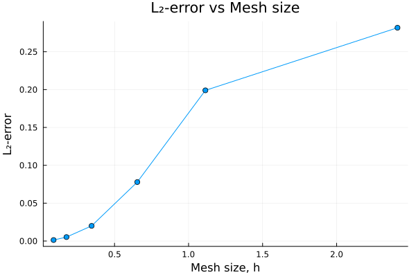
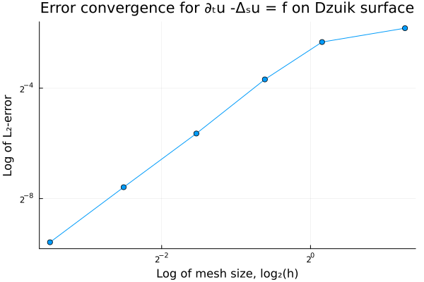

# Solving the time-dependent Laplace-Beltrami problem on the Dzuik surface
This folder aims to solve the time-dependent heat equation problem
```math
\partial_{t}u-\Delta_{S}u = f \quad \mathrm{on} \quad \Omega_{h}
```
where $\Omega_{h}$ is a mesh of the Dzuik surface with (greatest) edge length, $h$. 

A manufactured solution,
```math
u_{exact}(x,y,z,t) = u_1(x,y,z) \cdot u_2(t) = xy \cdot \sin{\left(t+\frac{\pi}{2}\right)}
```
was chosen and its corresponding RHS function,
```math
f_{rhs}(x,y,z,t) = u_1\cdot \partial_{t}u_2 - u_2 \cdot k\Delta_{S}u_1
```
was computationally derived.

## Results


| **Refinement** | **Mesh Size** | **Δt** | **L2 Error** | **EOC** |
|---------------:|--------------:|-------:|-------------:|--------:|
|              0 |       2.41091 |    0.1 |     0.281694 |       - |
|              1 |       1.11357 |    0.1 |     0.199011 |   0.450 |
|              2 |      0.653692 |   0.04 |    0.0778604 |   1.762 |
|              3 |      0.345323 |   0.01 |    0.0200012 |   2.130 |
|              4 |       0.17548 |  0.003 |   0.00519552 |   1.991 |
|              5 |     0.0883758 | 0.0007 |   0.00130433 |   2.015 |

Final time: $T=2\pi$

  

## Implementation

### Mesh generation
The meshes of varying mesh sizes were created using Gmsh (See [include/gen_refined_Dzuikmesh.jl](../../include/gen_refined_Dzuikmesh.jl))

### Error calculation
See [documentation](../../include/README.md#error_funcs_readme) for [include/funcs_error_analysis.jl](../../include/funcs_error_analysis.jl)

### R.H.S function
$\partial_{t}u_2$ and $\Delta_{S}u_1$ were computationally found (See [create_manufactured_sol.jl](create_manufactured_sol.jl)), and stored in two files: [cfunc_dt_u2.jl](cfunc_dt_u2.jl) and [cfunc_negLBO_u1.jl](cfunc_negLBO_u1.jl). These were then read and combined into one function (See [manufactured_sol.jl](manufactured_sol.jl)) before simulating the system.

### Implementation
TBW